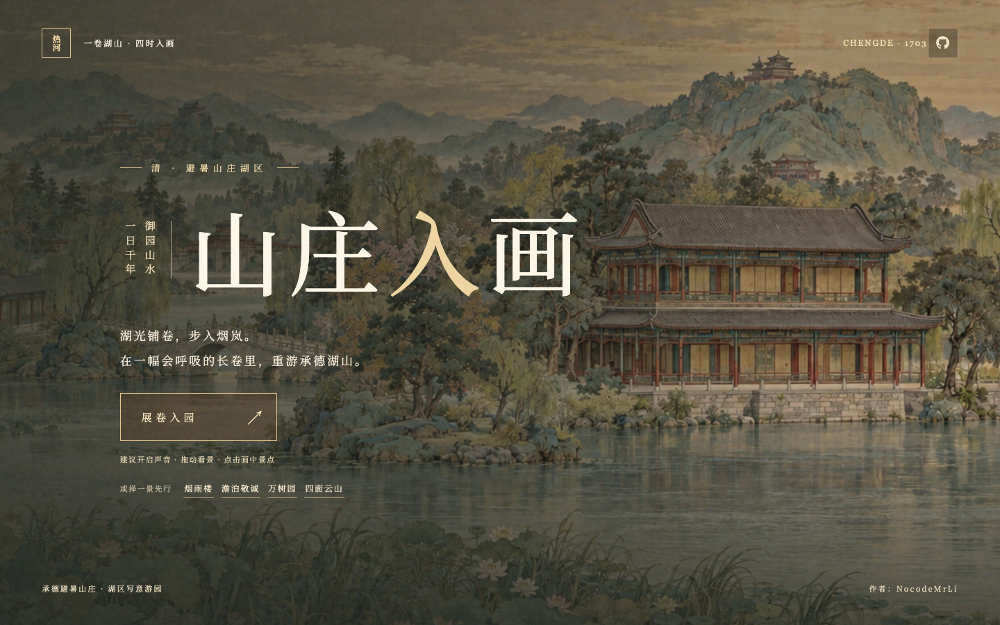
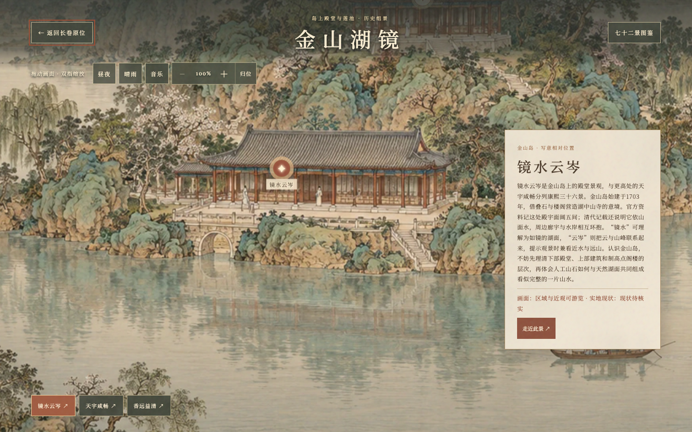
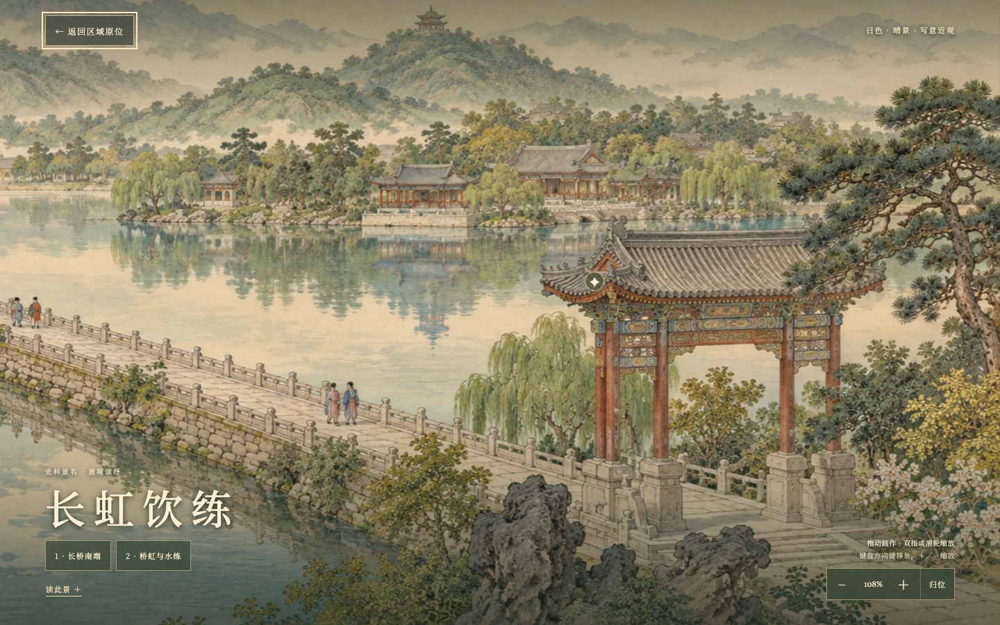
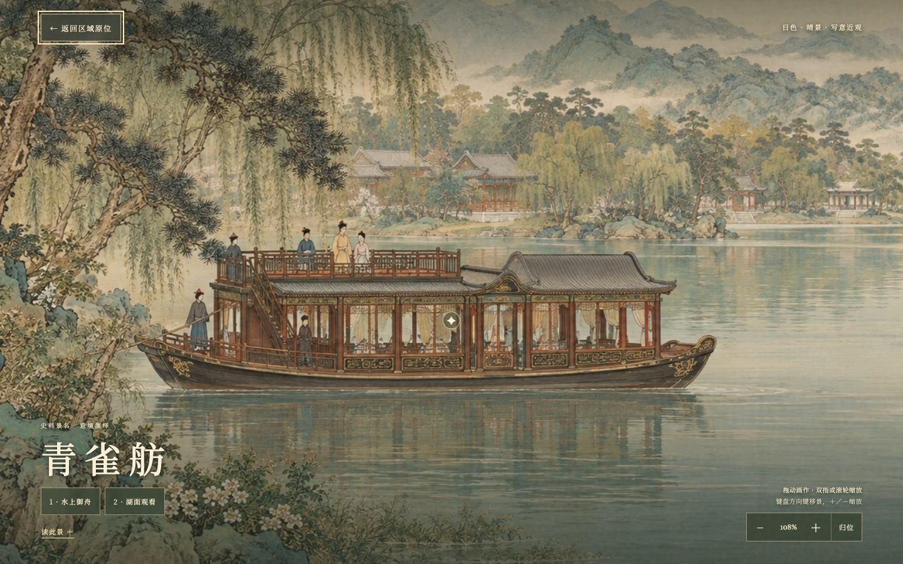

# 山庄入画 · 承德避暑山庄互动长卷

以承德避暑山庄的湖泊、宫苑、平原与山峦为题材的国风互动作品。展开画卷，拖动游览，循着景名走近湖山，切换昼夜晴雨，听一曲古琴《平沙落雁》。支持桌面与手机浏览器。

**[在线游览](https://nocodemrli.github.io/chengde-mountain-resort/)** · [线上构建标识](https://nocodemrli.github.io/chengde-mountain-resort/deployment.json)

> 本开发分支完成七十二景对应画面，尚未合并 `main` 或发布到上述在线入口。公开站仍以 `main` 为准。最新本地验收见 [最终候选记录](docs/final72-review.md)。



## 可以怎样游览

- **展开长卷**：横向拖动或滚轮浏览四大景区，点击景点进入近观；返回时恢复原来的镜头位置。
- **深入园景**：18幅区域画卷连接康熙、乾隆各三十六景。72个历史题名都有对应可进入画面，其中68景经区域近观，4景经主长卷近观。
- **细看景物**：区域支持拖动与100%–160%缩放；区域近景支持拖动、滚轮或双指缩放至240%，每景有两个细看焦点，文字可展开或收起。
- **晴雨昼夜**：湖水、云雾与灯火随环境变化；室内框景和檐下场景将雨层限定在窗外、檐外。人物、画舫与马为静态绘景，梅花鹿保留动作与点击反馈。
- **七十二景图鉴**：搜索景名或别名，按朝代、区域、游览状态筛选，直接定位对应景物；成功显示近景后才记录“已游览”。
- **听琴入画**：声音开关可播放或静音古琴录音。景点讲解为文字，尚无语音讲解。
- **安心返回**：展卷动画可跳过；区域与近景加载失败或超时可重试、返回，迟到请求不会覆盖当前场景。

<details>
<summary>查看金山、长桥与青雀舫画面</summary>







</details>

七十二景指两朝题名的景致，不等于七十二座现存建筑。双湖夹镜与长虹饮练是同一桥的两个角度；临芳墅与知鱼矶是一院两景；青雀舫是历史御舟。作品为这些题景分别创作观看画面，没有将同一张图换标题充数。图鉴的“已游览”只代表在数字作品中打开过画面。

## 画面与资料边界

美术依据已核实的历史题名、组群、形制与观看线索作原创意境演绎。具体院落、家具、植物、岸线和相对位置不是实地测绘或精确历史复原。未核实的当前存状会明确标注；旧址研究不等于建筑已经实体重建。磬锤峰在山庄园外，在本作中作为园内借景呈现。

作品使用二维分层绘景与镜头移动；人物行走、乘船操作、三维漫游和语音导览未实现。主长卷仍有少量色调与地貌视角差异，未宣称全卷完全无缝或达到参考作品全部质感。此项目是独立创作，非景区官方产品。

## 本地运行

需要 **Node.js 18或更新版本**；项目没有第三方运行依赖。

```sh
git clone --branch codex/lake-finish-20261002 https://github.com/NocodeMrLi/chengde-mountain-resort.git
cd chengde-mountain-resort
npm run dev
```

浏览器打开 <http://127.0.0.1:4173/>。端口被占用时，可用 `PORT=4174 npm run dev`。

检查构建后的版本：

```sh
npm run build
npm run preview
```

静态文件输出至 `dist/`。可通过页面 `data-build` 属性或 `/deployment.json` 核对构建标识。各幅区域与近景按进入时加载，下载源码中的原始PNG归档不等于网页首次下载全部美术。

## 验证记录

- [山地批次](docs/mountain-depth-review.md)：新增9景、区域加载错误隔离、17幅透明素材无损WebP，以及初始图片请求约27.23MB降至4.67MB的本机测量。
- [宫苑与平原批次](docs/palace-plains-review.md)：新增14景、4区域、室内分区雨层与短屏控件命中检查。
- [最终水岸批次](docs/final72-review.md)：新增20景、5区域、完整72景进度核对、模拟手机与最终候选截图。

验证使用本机Chrome及360/390/430宽模拟手机。真机、低端设备、真实带宽性能未测；模拟触摸结果不视作真机验证。具体通过项目与测试范围以各批记录为准。

## 项目结构

| 路径 | 内容 |
| --- | --- |
| `index.html`、`style.css`、`app.js` | 入口、主长卷、近景、环境与声音交互 |
| `public/region.js`、`public/atlas-data.json` | 区域镜头、近观、七十二景资料与图鉴 |
| `public/art/` | 运行绘景、静态人物、动物、前景与图标 |
| `public/audio/` | 古琴录音转码文件 |
| `sources/*-art/` | 原始生成图片、修订与逐文件资源清单 |
| `sources/research/` | 历史文案与研究来源，仅供开发核对 |
| `docs/` | 展示图、实际进度与验收证据 |
| `scripts/build.mjs`、`server.mjs` | 静态构建、资源指纹与本地服务器 |
| `ASSETS.md`、`sources/AUDIO-LICENSE.md` | 素材授权、署名与改动说明 |

## 发布与更新

[Publish handscroll](.github/workflows/pages.yml) 仅在推送到 `main` 或手动触发时发布GitHub Pages；Pages Source需设为 **GitHub Actions**。独立开发分支用于审阅与备份，推送这些分支不会自动更新公开站。

完成验收并合并发布后，继续使用上方同一个在线入口。可在 [Actions](https://github.com/NocodeMrLi/chengde-mountain-resort/actions) 查看部署状态。JS、CSS与图像、音频URL带内容指纹；只修改本地文件不会更新线上站点。

## 许可与素材署名

- **源代码**：[MIT](LICENSE)。该许可不涵盖下述绘景和音乐。
- **美术**：本项目独立构思、借助AI图像工具生成与整理，非景区实拍；未复制参考网站美术。图像单独复用或再发布请先联系维护者。README展示图为本作品截图。GitHub标识来自MIT许可的Primer Octicons，见 [ASSETS.md](ASSETS.md)。
- **音乐**：[《平沙落雁》](https://commons.wikimedia.org/wiki/File:Pingsha_Luoyan.ogg)，演奏与录制 **Charlie Huang**，按 [CC BY 2.5](https://creativecommons.org/licenses/by/2.5/) 使用。本项目转为AAC/M4A并作轻微频段过滤；复用须保留署名、来源、许可及改动说明，详见 [ASSETS.md](ASSETS.md)。

参考互动长卷仅用于研究呈现方式，本项目没有复用其代码或美术。
