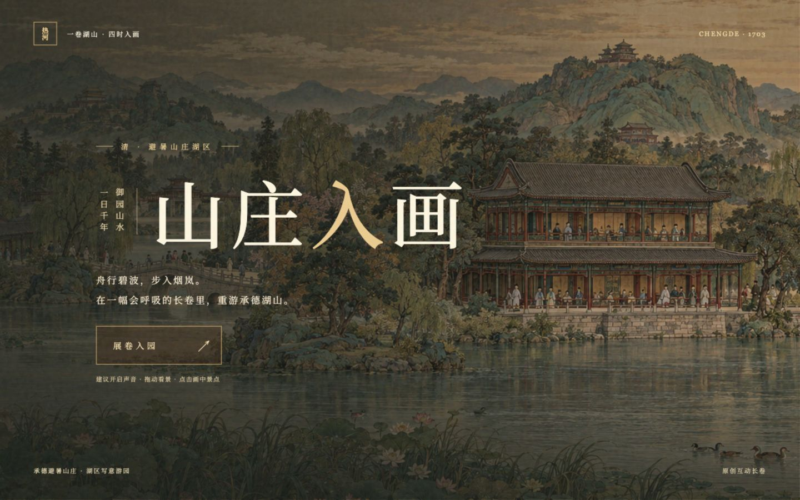
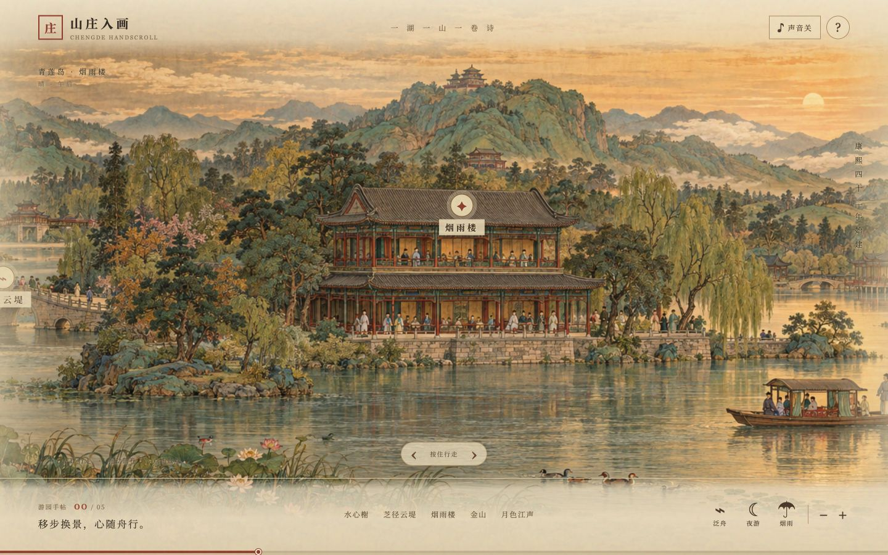
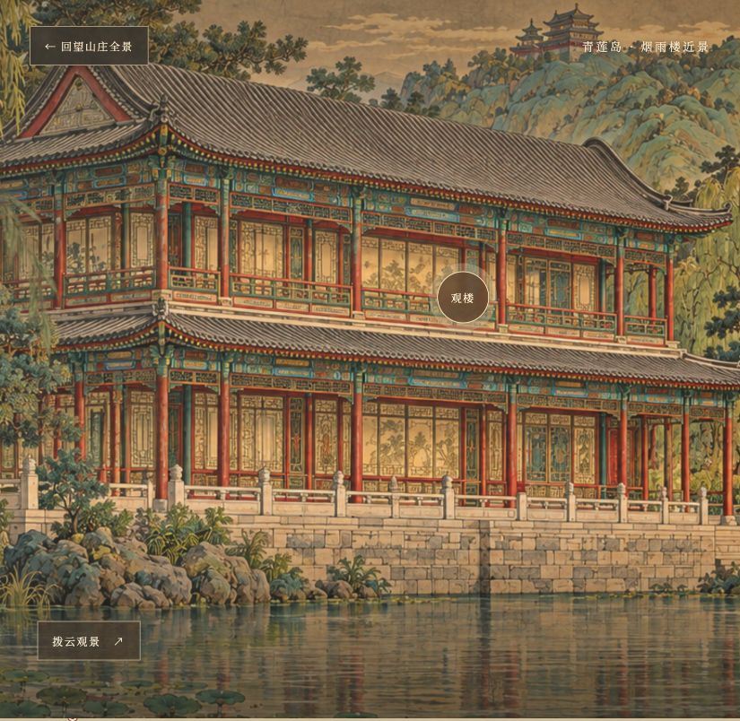

# 山庄入画 · 承德避暑山庄互动长卷

以承德避暑山庄为灵感创作的国风互动长卷。展开画卷，沿湖山游览，在烟雨楼等景点切换近景，并体验昼夜与晴雨变化。支持桌面和手机浏览器。

**[在线游览](https://nocodemrli.github.io/chengde-mountain-resort/)** · [查看线上构建](https://nocodemrli.github.io/chengde-mountain-resort/deployment.json)

仓库公开，供作品展示与查阅；本版本自有新增成果保留权利，不授予另行复用、修改、再分发或商业使用许可，其他用途请先取得授权。此前 MIT 历史版本及第三方素材继续适用各自许可，见 [LICENSE](LICENSE)。公开仓库和网站资源可被查看、下载，权利声明不构成下载限制。当前版本与更新内容见 [CHANGELOG.md](CHANGELOG.md)。

保留权利只适用于项目权利人享有权利、且未受历史或第三方许可约束的新增成果。GitHub 平台依其条款提供的查看、fork 权利及法定允许的使用情形不受本说明剥夺；AI 辅助制作不表示每一项生成素材均已获得法律确认的原创版权。首页“版权与使用说明”提供相同边界及联系入口。



<details>
<summary>展开查看画卷与烟雨楼近景</summary>





</details>

## 如何游览

1. 打开公开作品网址，选择“展卷入园”。首次加载会读取较大的绘景图片，请稍候。
2. 在画面上拖动，或使用鼠标滚轮浏览长卷；使用画面中的导航、景点标记跳转。点击景点标记可进入近景，再返回全景。
3. 用底部和侧边控制切换景区、昼夜、烟雨与缩放；点击声音开关播放或静音古琴音乐。手机上可触摸拖动画面和点击控件。

主卷有四个景区和 11 处景点，另有 **72 景目录、18 个区域画卷、68 幅区域近观，以及 4 处主卷近观入口**。目录支持搜索，并保留游览进度；只有成功打开画面才计入游览。近观返回后恢复原来的画面位置和焦点，图片加载失败或超时可以重试。

**84 段自托管男声讲解**覆盖主卷和 72 景全文，总长约 62 分钟。点击“听讲解”才加载和播放，可暂停、续播和重听；切景或关闭面板会停止讲解，切到后台会暂停。讲解期间背景音乐自动降低音量。讲解使用固定的普通话合成男声音色，不依赖浏览器随机选择系统声音。

晴雨、昼夜可随时切换。雨滴具有长短、速度、透明度和远近差异，近景根据水面和室内窗口限定雨水与涟漪范围；隐藏页面会暂停，减少运动设置和性能降级会降低特效。夜间在部分建筑窗户与水面叠加暖光。梅花鹿可以移动并响应点击；画中的人物、船只和马保持静态绘景。

“建议反馈”位于入园页和游览工具栏，可发送邮件或复制邮箱；复制不可用时可直接选择文本。网页不会自动发送邮件，也不收集反馈表单。

画作之间仍有写意透视与色调差异，夜间灯光覆盖部分场景。手机布局、触摸及性能检查包含桌面浏览器模拟；真实手机、低端实体设备和物理双指操作尚未验证。音频经过完整解码和文稿覆盖检查，逐字读音与全部段落的听感仍需要人工抽听。

画卷以景点和山庄地貌为依据进行写意组合，不能用于实地导航、建筑测绘或历史复原。磬锤峰在山庄园外，这里以园内借景呈现。本项目是独立创作，非景区官方产品。

## 本地运行

需要 **Node.js 20 或更新版本**；项目没有第三方运行依赖。构建校验音频时需要安装 `ffmpeg`（包含 `ffprobe`）；GitHub Actions 会检查并安装它。本地播放已有音频不需要语音模型或生成环境。

以下命令用于本地展示、查阅与验证本作品；不扩大 [LICENSE](LICENSE) 中新增成果的使用范围。

```sh
git clone https://github.com/NocodeMrLi/chengde-mountain-resort.git
cd chengde-mountain-resort
npm run dev
```

打开 <http://127.0.0.1:4173/>。端口被占用时，可用 `PORT=4174 npm run dev`。

```sh
npm run build
npm run preview
```

构建结果在 `dist/`，`preview` 用于本地检查构建后的页面。可在页面的 `data-build` 属性或 `/deployment.json` 中核对构建标识。

## 发布与更新

推送到 `main` 后，[Publish handscroll](.github/workflows/pages.yml) 工作流会校验、构建并发布 `dist/` 到 GitHub Pages。Pages 的 Source 保持 **GitHub Actions**，部署后使用同一个公开网址，无需 Vercel、额外托管账户或自定义域名。每次更新后核对 `/deployment.json` 与页面 `data-build`；部署和缓存更新可能需要时间，可检查 [Actions](https://github.com/NocodeMrLi/chengde-mountain-resort/actions)。GitHub Pages 的国内访问速度及稳定性受网络影响，不能保证所有地区均稳定可达。

构建脚本会给 JavaScript、CSS 文件名及图像、音频 URL 加内容指纹，以便新版本加载对应资源。网站发布包不包含源码映射、开发资料、原稿、母带、模型、推理环境或凭证。公开仓库可下载源码，网页会向浏览器交付运行所需 HTML/CSS/JS、绘景和音频；可下载不等于允许超出适用许可范围使用。内部 QA、临时样音、模型与母带不上传到仓库或站点。

## 项目文件

| 路径 | 内容 |
| --- | --- |
| `index.html`、`style.css`、`app.js` | 页面结构、视觉样式与交互 |
| `public/art/` | 长卷、景点近景、人物、动物和遮罩素材 |
| `public/audio/` | 古琴录音、84 段讲解与逐段来源及校验清单 |
| `public/weather.js`、`public/lighting.js` | 雨水、遮挡与夜间建筑光效 |
| `public/guide.js`、`public/feedback.js` | 讲解播放器与联系入口 |
| `scripts/build.mjs`、`server.mjs` | 静态构建、本地开发与预览 |
| `docs/images/` | README 展示图 |
| `scripts/check-scenic-links.mjs`、`scripts/check-guides.mjs` | 72 景入口、文稿覆盖与完整音频解码校验 |
| `ASSETS.md`、`sources/` | 素材、音乐、合成讲解和图标许可 |

## 许可与素材署名

- **本版本自有新增成果**：[保留权利说明](LICENSE)。仓库公开供展示查阅，网页提供在线游览；新增代码、文案、绘景和合成讲解的另行复用、修改、再分发及商业使用须先取得授权。
- **历史 MIT 版本**：此前已经按 MIT 公开的代码与其合法副本继续适用[原许可](licenses/LEGACY-MIT.md)，保留历史授权；此决定不能收回已授予的旧版本权利。
- **美术**：`public/art/` 为本项目独立构思、借助 AI 图像工具制作和整理的素材；不属于 MIT 许可。单独复用或再发布请先联系维护者。README 展示图是该作品的截图。
- **音乐**：[《平沙落雁》](https://commons.wikimedia.org/wiki/File:Pingsha_Luoyan.ogg)，演奏及录制：**Charlie Huang**，依据 [CC BY 2.5](https://creativecommons.org/licenses/by/2.5/) 使用。本站版本转为 AAC/M4A，并做轻微频段过滤；复用时须保留作者、来源、许可和改动说明。详见 [ASSETS.md](ASSETS.md)。
- **合成讲解**：使用 Qwen3-TTS 的 Dylan 音色和 mlx-audio 离线生成，统一响度后编码为 AAC；模型、工具及输出的许可边界见 [讲解来源说明](sources/NARRATION-LICENSE.md)。发布包不包含模型权重、推理环境或母带。
- **GitHub 图标**：来自 Octicons，依据 [MIT 许可](sources/OCTICONS-LICENSE.md) 使用。

反馈使用网页的建议反馈邮箱入口，参与申请通过邮件介绍方向；没有创建单独的公开反馈仓库。仓库保持公开时，[本仓库 Issues](https://github.com/NocodeMrLi/chengde-mountain-resort/issues) 也可供登录 GitHub 的访客按其规则提交问题。

想参与项目创作与完善的访客，可使用首页“建议反馈”或面板“申请参与项目”，通过邮件介绍方向；网站不会自动发邮件或自动授予协作者权限。

参考作品仅用于研究互动长卷的呈现方式，本项目没有复制其代码或美术。
